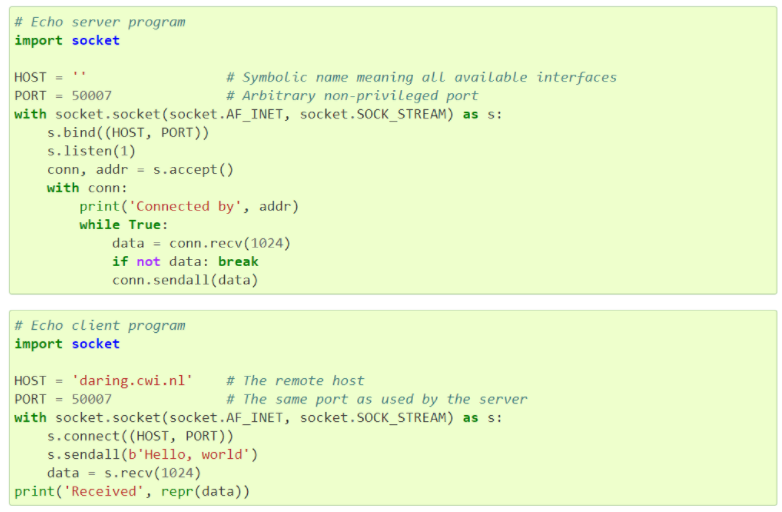
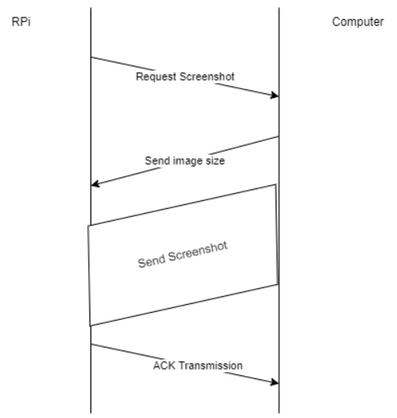
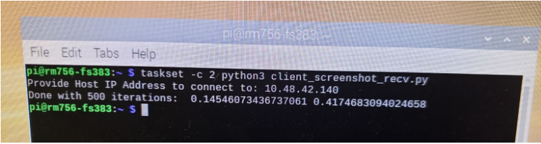
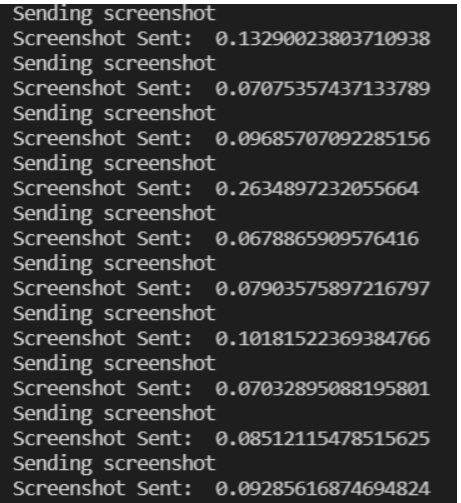
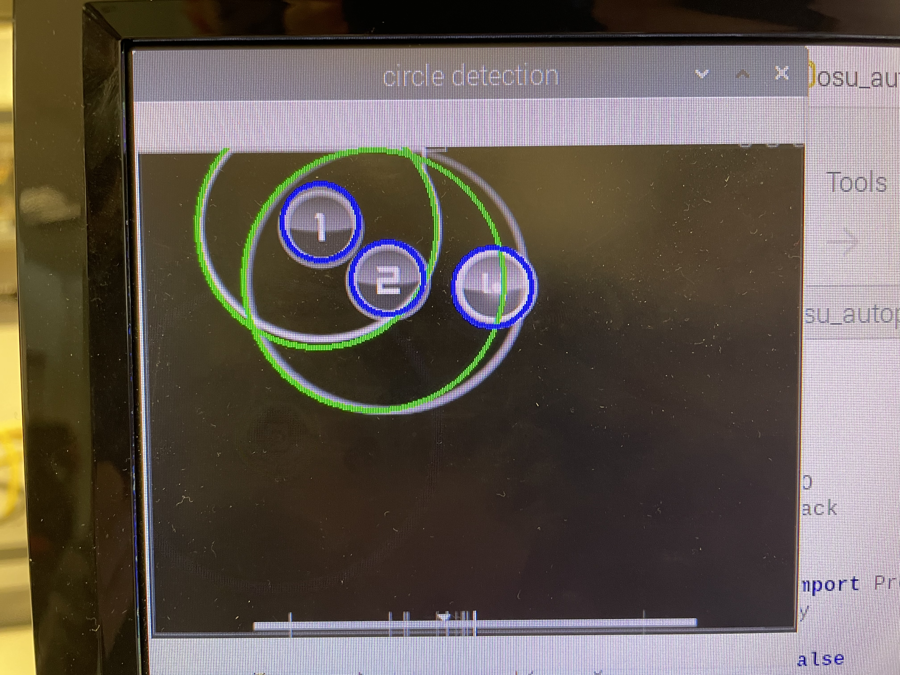
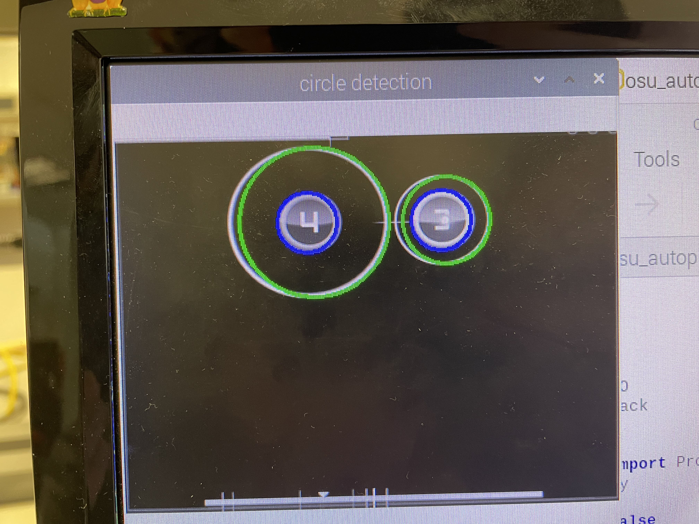
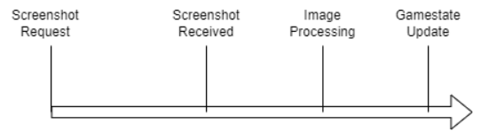

# Osu! Autoplayer

Osu! is a rhythm game where players perform a series of actions using a keyboard and mouse along to the beat of the music. The basic idea is that circles show up on the player's screen, and they have to click these circles along to the beat of the song. Clicking in the wrong location or not at the right time will lead to a lower score. For our final project, we wanted to create a system that automatically plays Osu! and is able to achieve high scores. Knowledge from several areas was used, including computer vision, multiprocessing, image processing, and computer networking. 

The autoplayer has two main components. One part of the system, located on the computer running the game, is in charge of taking screenshots of the Osu! gameplay and sending it to the Raspberry Pi. The Raspberry Pi receives and processes these images to identify where circles and other key features are located. The Raspberry Pi then decides where to move the mouse on the game screen and clicks on circles at the correct time. Our autoplayer is able to detect circles in real time and determine when and where to click on the screen to get the highest score. The Osu! autoplayer was completed by Felipe Shiwa and Ryan McMahon as part of our final project for ECE 5725: Design with Embedded OS. In the following sections, we will go over the design of this system and some of the challenges we encountered throughout the project.

## Mouse-Sharing Through Barrier and PyAutoGUI

One of the first challenges that we had to handle was sorting out how to control the mouse on the computer from the Raspberry Pi. After some investigation, we found that the Barrier application (https://github.com/debauchee/barrier) allows both mouse and keyboard to be shared between two devices without the need for a physical switch for sharing the input between the two devices. With the application installed on both devices, a wireless connection is established between the two devices, allowing the mouse to be dragged between screens and for the keyboard to be used on both screens. The only limitation of the Barrier application is that the application seems to only be executable through the Linux desktop, requiring the display to be open on the RPi end. Additionally, the version of the application on both devices had to match to work as expected, leading to the use of the 2.2 version being used as that is the one available on the RPi. In this version, the auto-config option did not work correctly for us, requiring that the IP address of the host device be indicated manually to set up the connection.

To control the mouse input through Python, we explored the PyAutoGUI library. This library supports capturing the mouse input from the desktop screen without requiring a specific window or clicks to detect the input. Through this library, the Python application is able to move the cursor to absolute and relative positions, as well as click down mouse buttons and control when the mouse button is pressed down. This library expects the DISPLAY variable in the OS environment to be set, which seems to only be the case when the Linux desktop view is open. When booting on the PiTFT on its own to the command line, this variable is not set and the library does not work as expected. Using this library further reinforces the need to have the Linux desktop display open on an external HDMI display to achieve the expected behavior.

We tested utilizing Barrier and PyAutoGUI together to control the mouse on the device connected to the RPi, and found that it is possible to control the mouse from the RPi on the secondary device with these libraries. For the Barrier setup, the RPi is set up as the server device, while the laptop to be controlled is set up as the client. PyAutoGUI has internal protections to prevent moving the mouse cursor outside the boundaries of the detected display; however, we need to exceed the boundaries of our display in order to set the mouse cursor position to the second device. The parameter FAILSAFE can be set to False to remove the exception raised from exceeding the coordinates of the main display, allowing the mouse cursor to move beyond the main display.  However, the detected mouse position from the PyAutoGUI library once the mouse cursor is on the secondary display shifts to the center of the screen, likely based on how Barrier manages the mouse sharing between the two devices. It is possible to instead control the mouse coordinates accurately through movement relative to the current mouse position, as long as no duration for the mouse movement is indicated. 

We utilized a program running on the RPi and a separate program running on the computer whose mouse is being controlled to test the setup. The program on the RPi utilizes the PyAutoGUI library to control the mouse to our desired location on the external screen, while the program on the computer prints out the mouse position on its own device to compare against the expected result. During development and testing of the project, we ran into some issues with consistent synchronization of the mouse position on screen with what was expected from the code. This was particularly the case on mouse movements across a large span of the screen. Combining these observations with the previous observation of the mouse coordinate on the RPi being detected at the center of the screen while controlling the cursor off-screen, we concluded that only movements up to half the size of the resolution of the display connected to the RPi can be done in one call. We suspect that Barrier polls the mouse position offset from the center to update the mouse position on the connected device, without supporting overloaded coordinates extending beyond the screen’s resolution. After learning about this issue, the mouse control within the program works around this limitation to make incremental movements as necessary to reach the correct mouse coordinates. Otherwise, the mouse sharing process went relatively smoothly.

## Screenshot Transmission over TCP using Sockets

To have the gameplay information reach the RPi, we decided to utilize Python to transmit screenshots of the game from the device running Osu! using Python networking code. With a host client running on the computer end and a client side running on the RPi, the two devices communicate with each other to transmit screenshots of the game. Starting from the example code from the official Python socket documentation (https://docs.python.org/3/library/socket.html#:~:text=override%20this%20setting.-,Example,-%C2%B6), we established a connection between the two devices utilizing TCP, using the IP addresses of each of the connected devices to the network. 

One of the issues we found was that images were too large to receive in a single transmission. Conceptually, we figured that the image had to be sent in sections and then reassembled at the destination somehow. In the process of looking for a solution, we found this post, which suggests an useful approach to resolve this issue: https://stackoverflow.com/questions/42459499/what-is-the-proper-way-of-sending-a-large-amount-of-data-over-sockets-in-python. If the image can be converted into a byte stream, then the byte stream can be sent to the destination and retranslated back into the image if the settings for the image and the size of the image were known. 

The protocol used for transmitting the image is shown on the diagram above. For the destination to know when the full image has been received, an initial transmission with the length of the image to be sent is used. From there, the received bytes can be accumulated at the destination until the full length of the image has been received. Since we are already using the PyAutoGUI library in other files, we opted to use their screenshot function, which generates a Pillow image. The Pillow library supports the conversion of the image down to bytes and regeneration of the image back from bytes, allowing for successful transmission of images.

One of the main concerns that we have to deal with throughout the project will be latency in the different sections of the process, since the game will not wait for the autoplayer to determine the action to take from when the screenshot is first taken. When we first had image transmission working, the screenshots were sent in full color and full resolution from the desktop (1920 x 1080 RGB image). The transmission of a single screenshot took well over a second, which is unreasonable for the rate at which the decisions need to be made to play the game. As a result, we decided to pre-process the image at the computer end by cropping the image down to the play section, downscaling the image down to a lower resolution (400 x 300), and converting the image to grayscale. After these changes, the average time for the image transmission has reduced down to around 150ms. Timing the image transmission timing between image requests over 500 iterations, we saw that the maximum transmission time can end up being as high as 350ms.  This caused some performance issues at certain points when running the device; however, the latency was good enough for our use case most of the time.

## Exploring TCP Screenshot Transmission Latency

One of the main issues we encountered previously was the issue with screenshot latency being inconsistent. Our initial thought was that the variable latency issue may be caused by scheduling interference with other Linux programs, as the latency in the screenshots varied from close to 100ms to above 400ms. We decided to isolate a CPU core (we arbitrarily chose to isolate core 2) and execute the screenshot section of the code on the isolated core (shown as core 3 on htop because of one indexing) to attempt to solve the issue. However, despite isolating the core we continued to observe the same latency on transmission.

Looking at the host side of the connection, the latency for the screenshot transmission is high at the point of sending the screenshot, which would also be seen as an increase in the reception latency. A potential solution to the latency could be to shift from TCP to UDP since UDP simply attempts to transmit without any guarantees of arrival of the data or ordering. Depending on the error rate and transmission rate of UDP, it may be possible to simply drop and skip malformed frames and still manage a better frame rate than with TCP. However, this requires further investigation to resolve the issue. At the moment, we work around the issue by separating this latency from the main loop with multiprocessing.

## Circle Detection

Now that we were able to send screenshots from the Osu! game to the Raspberry Pi and control the game mouse from the Raspberry Pi, we began work on the image processing component of the system. The basic version of the game has two sets of circles. The smaller inner circles are all the same size and are where the player is supposed to click. The larger outer circles shrink over time, and the player clicks the inner circle once the outer circle has shrunk to the same size. 

## Predictive Updates

Once we have detected a certain note, it is not always the case that the outer circle will be correctly detected. Additionally, if we can predict how fast the outer circles are shrinking, then we can update the game state on the RPi in between screen shots to have the game state match more closely to the true state  of the game on the computer. We can accomplish this using predictive updates, approximating the outer radius of each of the notes based on previously observed changes in the radius of the outer radius and taking into account the amount of time since the last update. However, this process requires the RPi program figuring out what approach rate that should be used to perform these updates.

To test the process of predictive updates, we first made use of a fixed approach rate that matched the rate at which the outer circle shrank for the maps that we tested. We utilized time stamps from the end of the previous update call to track the amount of time that has passed between circle updates. When a note with a known outer circle was not updated in a given iteration, we applied our predictive update to reduce the outer radius by our approximate amount by taking into account the amount of time between updates and the rate at which the outer radius is expected to shrink. In this process, we compared our predicted values compared to the actual values from the screenshots, and found that the prediction process could get a good approximation of the observed outer radius in the screenshot, approximately within 2 pixels of the observed values from screenshots when the approach rate is set correctly.
  
The next step was to implement a process for the program to learn the approach rate that should be used without having the value be hard-coded within the program. The initial approach that we used was to take a single sample per screenshot (when possible) to approximate the approach rate based on the time difference between updates and to take an average of all samples collected. This worked to a certain degree but had two limitations. For one, outlier measurements sometimes would happen and yield significantly larger or smaller values than expected, affecting the computed average. Next, if the map were to be changed while still running the autoplayer, then the autoplayer would not be able to correctly adapt to the new approach if it were different from what it previously recorded. To accommodate this, we utilized a running average approach with a stronger bias towards more recent results. For each outer radius update, we collect samples using the same process as before; however, to update the predicted approach rate of the system, the new sample contributes a fraction of the new value, with the rest coming from the original value. This is a common way of updating weights as part of evolutionary algorithms that want to solve for a parameter, where over multiple iterations the correct value can be learned. With this process, the autoplayer can adapt to new approach rates without having to restart. Furthermore, while outliers can have a more immediate impact on the system approach rate when measured, these values are filtered out more quickly over time as their contribution decreases more quickly than averaging across all samples. Additionally, this process does not require storing all of the observed results, which over a long period of time could slow down the system.

## Correcting the Game State for Delay

With the use of the predictive updates, we can additionally take into account the delay from when the screenshot was taken compared to when the game state update happens. Initially, we attempted to click on a note significantly earlier than when the two circles overlapped (when the difference between the two radii lengths was less than 15). However, this does not factor in the latency observed when transmitting the screenshot using TCP and the processing time of the image itself, leading to a delay in the game state within the RPi compared to the actual game state. By making use of the predictive updates, we can also factor in the initial delay to have the program gamestate more closely approximate the true game state on the computer.

As previously mentioned, we make use of the difference in the time stamps for the game state to perform the predictive updates. However, since we used the observed values from the screenshots to update the game state on the RPi, the game state was delayed compared to real-time by the amount of time that passes between the screenshot request and the gamestate update at all times. By tracking when the screenshot was taken, applying the predictive update on the game state when factoring in the new outer radii of notes or adding new notes to the state yields a game state that is significantly closer to the true value. We could verify this by noticing that the timing on hitting the notes would be correct when the outer radius was approximately the same size as the inner radius.

## Using Multiprocessing to Parallelize Screenshots (Shared Memory)

To parallelize the autoplayer, we made use of the Python multiprocessing library and used the Process object to initialize separate instances running different functions. The first step that we wanted to separate from the main loop to a parallel process was the screenshotting process. One of the main reasons to parallelize at all was to be able to update the game state in between screenshots and decide to move the mouse closer to when the note is intended to be clicked (making use of the predictive updates). The screenshotting part of the loop introduced significant latency and prevented the mouse from being controlled when performed serially, so this was a reasonable section to want to parallelize. To do so, we had to establish a setup for both processes to have access to the image information, where the screenshotting process writes to the array while the main process reads in the image when a new image is available. A shared multiprocessing Array object was made where the image was stored. However, the image is intended to be interpreted as a numpy array, which is not directly supported by the Array object. Instead, the Array object is a linear, fixed-size list of a specific object type (integers in this case for grayscale values).  From there, the numpy array of the screenshot can be copied into the shared Array object, from which the main loop can copy the values back to a numpy array, correcting the shape and data type back to the expected values.

Two additional values had to be shared between the two processes for the overall system functionality to be maintained. First, the time of the screenshot request has to be recorded and updated to match the screenshot request time of the screenshot currently being shared. This is the value used to correct the game state to closely match the real-time state, as mentioned in the “Correcting Game State for Delay” section. Next, a value needs to be shared with the main process as a method of indicating when a new image is available. If it was reliable that the main process iterates faster than the screenshot reception, then a toggling value would be enough to know when the image has changed. However, since this may not necessarily be the case (with image processing usually requiring about 100ms only for tap notes), an incrementing tag value is tracked and associated with each screenshot. The main program can then track the last seen tag to know when a new image is available and to read in the image into the process.

Once the final setup was implemented, progress was smooth and the system worked as expected, with the same functionality as the serial version of the program. However, while attempting to implement this setup, searching for suggested setups for sharing numpy arrays online yielded multiple different suggestions that we found were confusing or did not work correctly. Instead, opting for this simple approach, the sharing of the numpy arrays worked well. One important thing to note is that for the shared values in this program, we had to remove the locks that are normally placed on these objects to limit access by both processes at the same time because of performance issues when the locks were present. While this can result in some situations where incorrect values were read, we did not find that removing the locks were detrimental to the recovered values when reading them. Additionally, if these objects were to have protected access to ensure consistency across the parallel processes, larger critical sections would be required since the image array, screenshot timestamp, and image tag should all be updated simultaneously. This would have required a shared lock between the processes to establish these critical sections.

## Using Multiprocessing to Parallelize Mouse Movement (Message Passing)

After parallelizing screenshotting, we found that the mouse movement was still being affected by the image processing delay. As a result, we also decided to separate the mouse control and the corresponding tracking of the game state to a separate process from the original main loop that will now be only responsible for retrieving the image when available, processing the image, and communicating the information to our new process. Initially, we attempted to perform a similar process as before, having a shared list of values between the two processes to have the lists with the results of the image processing to be shared between the processes. Since the types of values are different, we attempted to use the Manager.list() proxy objects from the multiprocessing library to share these values. However, we ran into issues with this approach and had to backtrack on our approach.

After looking through the functionality that was intended, we decided to utilize queues from multiprocessing between the two processes and utilize message passing to communicate the values between the processes. Since Python variables do not have strict typing, we can send any type of object over the queue, facilitating the process of communicating the objects between the processes as long as they are not too large. Since the image processing results are generally not that large, the queues work well for our use case. The image processing instance can place the results on the queue while the mouse control instance is able to check the queue for when values are available, and using an agreed upon order between the processes, load the objects from the queue into the corresponding variables. We were able to verify that this worked by observing the same behavior as the serial implementation but with improved responsiveness.

After implementing the queue and having all three processes be separate, we were able to control the mouse with better timing now that the image processing did not interfere with the mouse control. Since the game state and the mouse control are so closely related, we did not expect to gain much if we attempted to separate processes for maintaining the game state and to control the mouse, if not make the overall performance worse instead. While progress went smoothly while adding in the queue for parallelizing the two processes with message passing, one important detail to note is that while there are methods for checking whether a queue is full or empty, the documentation indicates that these are not reliable. As a result, we utilize a control message as the first value put into the queue before transmitting the results. This was additionally convenient since the control of the running state of the program was in the image processing loop; however, with the mouse control on a separate process, PyAutoGui raises exceptions when two processes attempt to control the mouse at the same time. This was solved by moving the mouse position reset to the mouse control process and having a “reset” request be sent through the control message that is extracted from the queue when checking whether the queue has any values.
